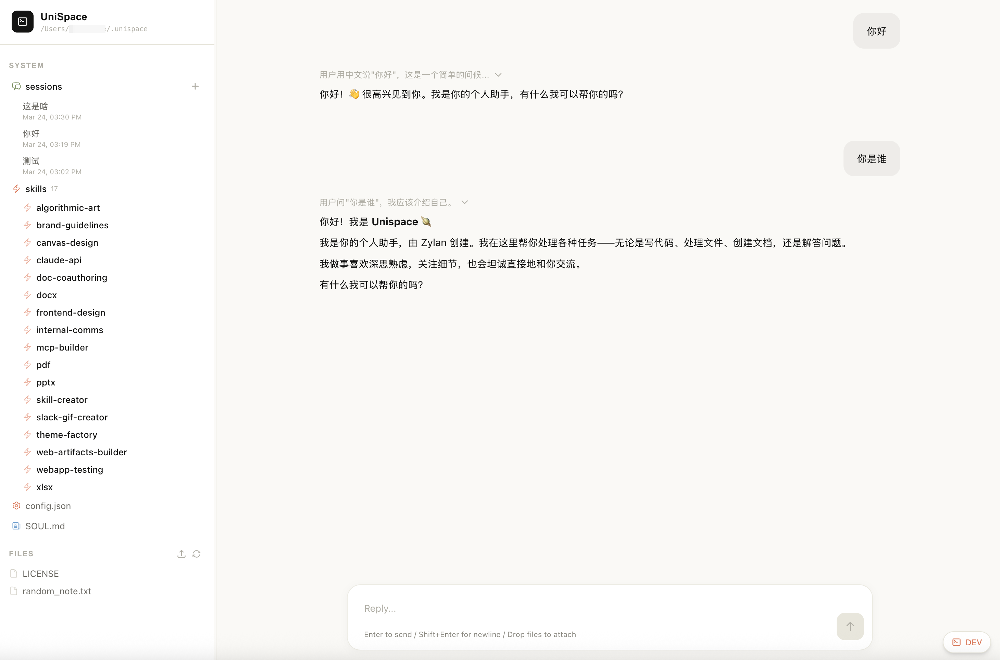

# UniSpace

一个浏览器里的 Claude Code，围绕 **project** 展开：每个 project 是一个独立的工作文件夹，有自己的人格（`CLAUDE.md`）、技能（`.claude/skills/`）、对话历史。项目之间通过 **clone** 复用，想给另一个场景造一个新 agent，复制一份就行。

底层是 `@anthropic-ai/claude-agent-sdk`，前端是 React，全部在本地跑。



---

## 为什么

给非工程师用 Claude Code 有两个门槛：一个是终端，一个是"一个目录 = 一个 agent"的心智模型。

UniSpace 解决这两件事：

- **浏览器里完成所有交互。** 对话、文件、切项目、看技能，全部可视化。
- **project 是一等公民。** 切换项目 = 切换 agent 的人格、上下文、skill 集合。新项目不用配置，复制一个现有的就好。

---

## 能做什么

**Project 形态** — `~/.unispace/projects/<name>/` 下放 `CLAUDE.md` / `.claude/skills/` / `sessions/` / `files/`。目录结构对齐 Claude Code 原生布局，想把一个 project 发给别人？把文件夹 zip 或 `git push` 就行。

**Project clone** — 一键复制当前 project 为新 project。会话历史不会被带走，干净起点。

**CLAUDE.md 人格** — project 根目录的 `CLAUDE.md` 是这个项目 agent 的性格、原则、上下文。SDK 每次对话自动加载。

**Skill 系统** — 18 个预置技能（PPT/PDF/Excel/文档协作/代码生成……）在 `.claude/skills/` 里，SDK 原生识别。

**完整文件系统访问** — Read/Write/Edit/Bash/Glob/Grep/WebFetch/WebSearch/TodoWrite/Task/Skill 全部开放，`cwd` 锁在当前 project 目录。

**多会话管理** — 会话持久化到 project 的 `sessions/` 下，随时切换恢复。

**Dev panel** — 开发模式下实时查看 CLAUDE.md、工具清单。

---

## 快速开始

前置：本机装好 Claude Code 并完成 `claude login`。UniSpace 通过 `@anthropic-ai/claude-agent-sdk` 复用 Claude Code 的登录态和默认模型，不需要再填 API key。

```bash
git clone https://github.com/Zippland/unispace.git
cd unispace
cd server && bun install && bun link && cd ../web && bun install && cd ..
unispace
```

首次运行会自动创建 `~/.unispace/projects/default/`。API 服务在 `localhost:3210`，Web 界面在 `localhost:5174`。

> **从旧版升级？** 0.3 之前的扁平 workspace 结构不兼容，先 `rm -rf ~/.unispace` 再 `unispace` 启动一次。

---

## Workspace 布局

```
~/.unispace/
├── config.json          # 全局：port / currentProject（认证走 Claude Code）
└── projects/
    ├── default/
    │   ├── CLAUDE.md    # 这个 project 的 agent 人格 + 项目背景
    │   ├── .claude/
    │   │   └── skills/  # project 级技能
    │   ├── sessions/    # 会话历史（每个 session 一个 .json）
    │   └── files/       # agent 的工作文件
    └── <your-other-project>/
```

---

## CLI

| 命令 | 说明 |
|------|------|
| `unispace` | 启动 server + web（默认） |
| `unispace dev` | 带 dev 面板启动 |
| `unispace start` | 仅 API 服务 |
| `unispace web` | 仅 Web 界面 |
| `unispace onboard` | 交互式配置 |
| `unispace project list` | 列出所有 project |
| `unispace project clone <from> <to>` | 复制一个 project |
| `unispace project use <name>` | 设置当前 project |

---

## 配置

`~/.unispace/config.json` 只有两个字段：

```json
{
  "server": { "port": 3210 },
  "currentProject": "default"
}
```

模型和认证走本机的 Claude Code。想换模型？用 `claude` 的 `/model` 或改 Claude Code 的设置，UniSpace 会自动跟随。

---

## 方向

UniSpace 现在是一个本地 demo，给"非工程师用 Claude Code"这个形态做个具象的靶子。接下来想探索：

- **Managed context** — 让 agent 自己维护 `CLAUDE.md`，把对话里的长期上下文沉淀进去
- **Task 提取** — SDK 的 TodoWrite 已经有了，前端把它可视化成一个 project 级的 todo 面板
- **Skill 共享** — project 之间共享 skill，`~/.unispace/skills/` 作为全局层

协作不做，从 project 拷贝和 git push 开始。

---

## License

MIT
